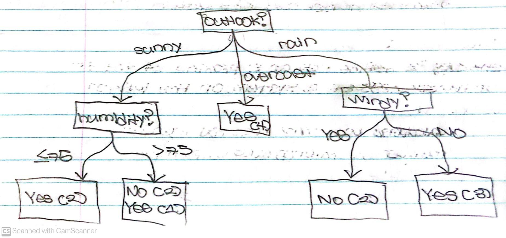

# Decision Trees and Random Forests

## Contents
* [Brief Description](#Brief-Description)
    * [Tree Methods](#Tree-Methods)
    * [Example of Usage](#Example-of-Usage)
    * [Building Decision Trees](#Building-Decision-Trees)
        * [Benefits of Random Forests](#Benefits-of-Random-Forests)
* [Jupyter Notebook](#Jupyter-Notebook)
    * [Dataset](#Dataset)
* [Source](#Source)

## Brief Description
Decision Trees are Machine Learning Models which make predictions by cycling through every feature in a Dataset individually.
Random Forests are ensembles of Decision Trees that used random orders of the features in the Datasets.

### Tree Methods
Both Decision Trees and Random Forests are examples of "tree methods".

Decision Trees in particular have 2 types of elements:
<ol>
    <li>Nodes -> The locations where the Decision Tree splits based on the value of some attribute. 
        <i>The Root is the Node that performs the first split. </i>
        <i>The Leaves are the Terminal Nodes which predict the final outcome. </i></li>
    <li>Edges -> The outcome of a split to the next Node.</li>
</ol>

### Example of Usage
If you wish to predict whether your friend will play basketball with you, it's necessary to consider deciding factors
(i.e. weather, temperature, wind, fatigue). These features can be tracked alongside your friend's decision whether to play or not.
The accumulation of this data will be then used to predict if your friend will decide to play.

### Building Decision Trees
Deciding which features to split data on is mathematically complex. This concerns <i>Entropy</i> and <i>Information Gain</i>.
Machine Learning Practitioners address this issue with using many Decision Trees in a Random Forest. Here, a new random sample of
features is chosen for every single Decision Tree at every single split.

For Random Forests, Machine Learning Practitioners typically choose the size of the random sample of features (i.e. <i>m</i>) to be the
sqaure root of the number of total features in the Dataset (i.e <i>p</i>). Hence, the relation between m and p is as shown: <i>m = sqrt(p)</i>
Note that specific features are randomly chosen from <i>m</i>.

#### Benefits of Random Forests
Randomly selecting features as mentioned for each Decision Tree allows the collection of Decision Trees to become decorrelated. This reduces the variance
of the resulting model. If the Decision Trees are built manually, you may be inclined to use a particular strong feature as the top split of the Decision Tree. This would result in multiple Decision Trees with highly correlated predictions. This should be avoided since taking the average of highly correlated variables
doesn't help reduce variance.

## Jupyter Notebook
In our <a href= "https://nbviewer.jupyter.org/github/Dipto9999/ML-Introduction/blob/master/Decision_Trees_and_Random_Forests/decision_trees_and_random_forests.ipynb">Notebook</a>, we are working with a Dataset of Kyphosis patients to determine whether patients have the disease based on a Random Forests Algorithm.

### Dataset
The Dataset represents a group of patients that previously had Kyphosis and were tested again after having back surgery. It is <a href = "https://nickmccullum.com/files/kyphosis-data.csv">downloaded</a> from Nick McCullum's <a href= "https://nickmccullum.com">Website</a>.

## Source
<i>The information in this repository is derived from a FreeCodeCamp
<a href= "https://www.freecodecamp.org/news/a-no-code-intro-to-the-9-most-important-machine-learning-algorithms-today">Article</a> written by Nick McCullum.</i>