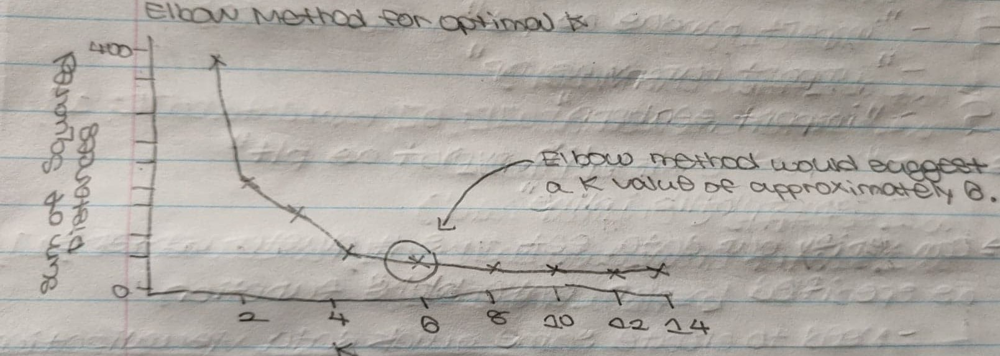
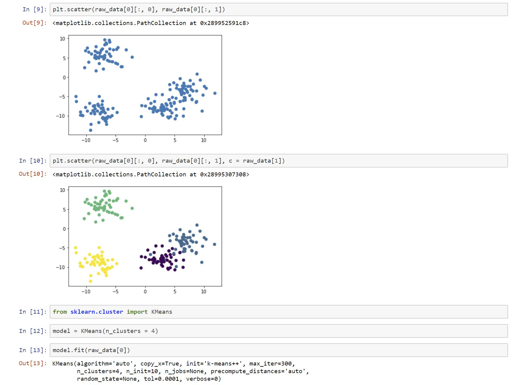

# K-Means Clustering

## Contents
* [Brief Description](#Brief-Description)
    * [Examples of Usage](#Examples-of-Usage)
    * [Unsupervised Algorithm](#Unsupervised-Machine-Learning-Algorithm)
    * [How K-Means Clustering Works](#How-K-Means-Clustering-Works)
    * [Picking Best K Value](#Picking-Best-K-Value)
        * [Elbow Method](#Elbow-Method)
            * [Sum of Squared Errors](#Sum-of-Squared-Errors)
* [Jupyter Notebook](#Jupyter-Notebook)
    * [Data Set](#Data-Set)
        * [Model Accuracy](#Model-Accuracy)
* [Source](#Source)

## Brief Description
K-Means Clustering is an Unsupervised Machine Learning Algorithm which is used for the identification of segments of similar data within a Data Set. Hence, it divides a Data Set into distinct groups. It does this by taking in unlabelled data and attempting to group similar clusters of observations together with your data. 

### Examples of Usage
This Machine Learning Algorithm is generally used for 2 types of predictions:

<ol>
    <li>Which cluster each data point belongs to.</li>
    <li>Where the center of each cluster is.</li>
</ol>

It is highly useful for solving real world problems. Examples include:
<ul>
    <li>Customer Segmentation for Marketing Teams</li>
    <li>Document Classification</li>
    <li>Delivery Route Optimization for Companies (e.g. Amazon, UPS, Fedex)</li>
    <li>Identifying and Reacting to Crime Centers Within a City</li>
    <li>Professional Sport Analytics</li>
    <li>Predicting and Preventing Cybercrime</li>
</ul>

### Unsupervised Algorithm
Since K-Means Clustering is an Unsupervised Machine Learning Algorithm, we are able to train our model without separating the Test Data and Training Data as in all previous Supervised Machine Learning Models covered in this tutorial.

### How K-Means Clustering Works
In order to run a K-Means Clustering Algorithm:

<ol>
    <li>Select the number of clusters you'd like to divide your data into (i.e. K value).</li>
    <li>Randomly assign each point in the Data Set to a random cluster to give our initial assignment.</li>
    <li>Run an iteration on our initial assignment until our clusters stop changing.
        <ul>
            <li>Compute each cluster's centroid by taking the mean vector of points within that cluster.</li>
            <li>Re-assign each data point to the cluster with the closest centroid.</li>
        </ul>
    </li>
</ol>

### Picking Best K Value
Since the K value changes the predictive power and simplicity of our K-Means Clustering Algorithm, we must be deliberate with the K value used to perform predictions on our Data Set.

#### Elbow Method
As with the K-Nearest Neighbors Algorithm, the Elbow Method can be used to determine a wise K value for our Data Set. 

##### Sum of Squared Errors 
In the K-Means Clustering Algorithm, it's required to compute the <i>Sum of Squared Errors (SSE)</i> for a group of K values. This is defined as the sum of squared distance between each data point in a cluster and that cluster's centroid. Generating a plot of the <i>SSE</i> against these different K values usually shows that the error decreases as the K value increases. Phrased differently, the more categories that exist within a Data Set, the more likely it is that each data point is close to the center of its specific cluster. 

<p align="center"></p>

The Elbow Method involves choosing a K value at which the <i>SSE</i> slows its rate of decline abruptly, producing an elbow-like shape in the graph.

## Jupyter Notebook
In our <a href= "https://nbviewer.jupyter.org/github/Dipto9999/ML-Introduction/blob/master/K-Means_Clustering/k-means_clustering.ipynb">Notebook</a>, we will use a Data Set of randomly generated data with the <b>scikit-learn</b> library. 

### Data Set
Our randomly generated Data Set comes with prepared clusters, which is atypical since the K-Means Clustering Algorithm is used to identify patterns which 
aren't known beforehand. 

#### Model Accuracy
For our purposes, the clusters included with the Data Set are rather useful for visually assessing the accuracy of our K-Means Clustering Model. We can compare the grouping of the data points in separate <i>scatterplots</i> using the <b>matplotlib</b> library in <b>Python</b>. 
_____________________________________________________________________________________________________________________________________________

```python
# Visualize the accuracy of the K-Means Clustering Model 
# by generating two different plots side-by-side.
    # Note that the coloring between the two plots may be different.
f, (ax1, ax2) = plt.subplots(1, 2, sharey = True, figsize = (10, 6))
        # One plot shows the clusters according to our Machine Learning Model.
            # Will notice that the model wasn't perfect. 
            # Data points are occasionally misclassified, usually along a cluster's edge.
ax1.set_title('Our Model')
ax1.scatter(raw_data[0][:, 0], raw_data[0][:, 1], c = model.labels_)
        # One plot shows the clusters according to real Data Set.
ax2.set_title('Original Data')
ax2.scatter(raw_data[0][:, 0], raw_data[0][:, 1], c = raw_data[1])
```
_____________________________________________________________________________________________________________________________________________

<p align="center"></p>

There is also a <a href = "k-means_clustering.py">Python Script</a> written with additional comments to further understand the procedure of developing this Machine Learning Algorithm. 

## Source
<i>The information in this repository is derived from a FreeCodeCamp 
<a href= "https://www.freecodecamp.org/news/a-no-code-intro-to-the-9-most-important-machine-learning-algorithms-today">Article</a> written by Nick McCullum.</i>