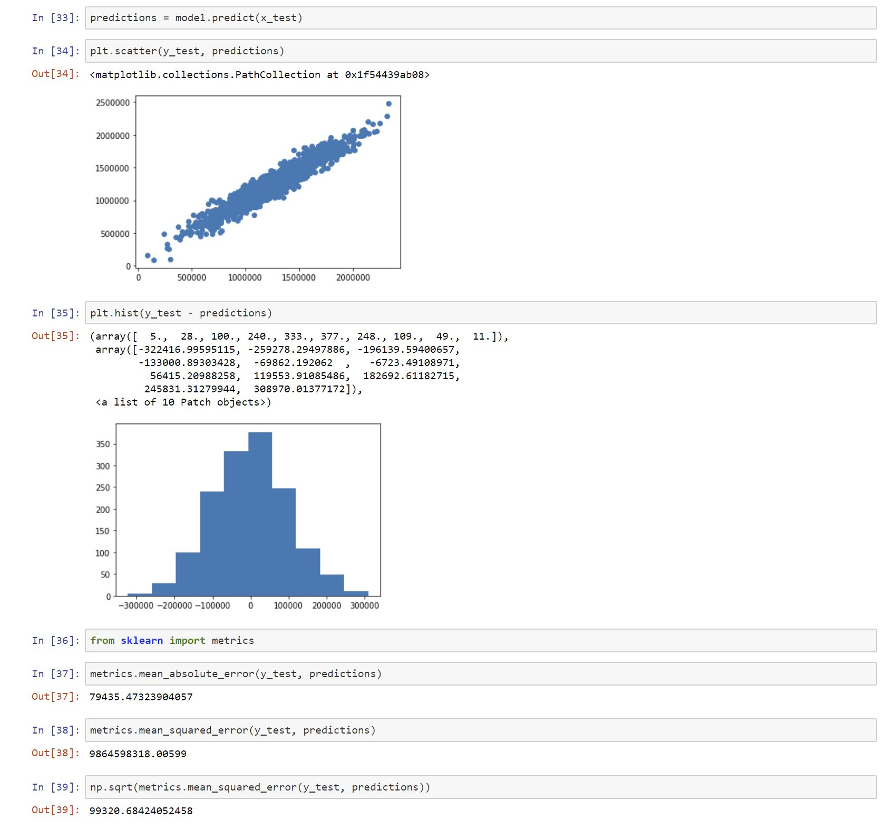

# Linear Regression

## Brief Description
Linear Regression is a Machine Learning Algorithm which is used to predict some y values based on a
set of x values. The end product of a regression model is an equation that you can use to predict the y-value of an x-value.
Note that you don't know the y-value in advance. 

## Jupyter Notebook
In our <a href= "linear_regression.html">Notebook</a>, we are working with a data set of housing data and attempt to predict housing prices.
The data set contains a number of features which are randomly generated. It is <a href = "https://nickmccullum.com/files/Housing_Data.csv">downloaded</a> from Nick McCullum's <a href= "https://nickmccullum.com">Website</a>.
These include:
    - Average Income in the Area of the House
    - Average Number of Total Rooms in the Area
    - Price the House is Sold For
    - Address of the House

## Source
<i>The information in this repository is derived from a FreeCodeCamp <a href= "https://www.freecodecamp.org/news/a-no-code-intro-to-the-9-most-important-machine-learning-algorithms-today/">Article</a> written by Nick McCullum.</i>