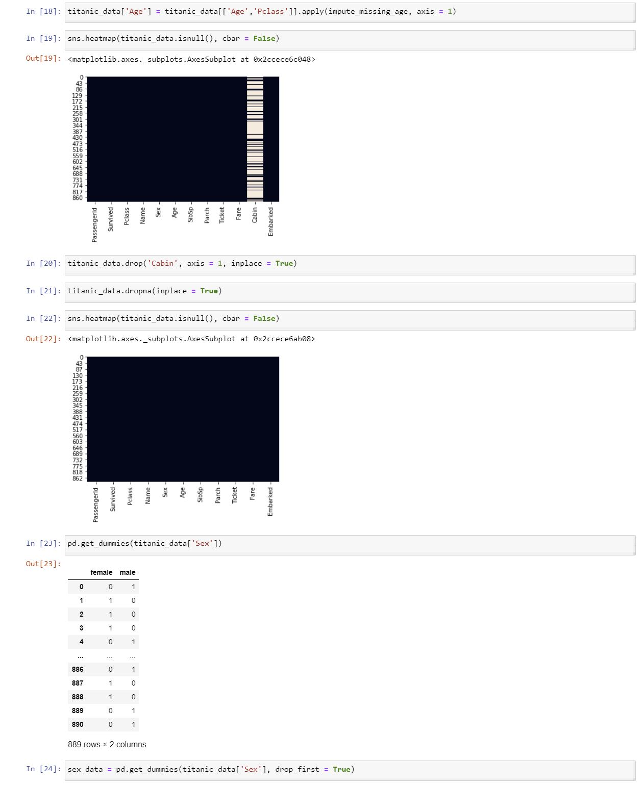

# Logistic Regression

## Brief Description
Logistic Regression is a Machine Learning Algorithm which is used to solve classification problems such as separating spam emails or disease diagnosis. 
It is somewhat similar to Linear Regression. However, instead of calculating a numerical y value, it estimates which category a data point belongs to. There are only 2 possible categories a data point may belong to (i.e. Binary Classification Problem). 

### Sigmoid Function
The line of best fit for Logistic Regression Models have a bend in the curve since they're not calculated using a linear equation as with Linear Regression.
The equation is given by f(x) = 1 / (1 + e^(-x)), otherwise known as a <a href = "https://en.wikipedia.org/wiki/Sigmoid_function">Sigmoid Function</a>. This will generate an output between 0 and 1 regardless of the input.

### Making Predictions
Generally a cutoff point is specified (e.g. 0.5) to separate data points into a category. For cancer diagnosis, the y-axis on the Logistic Regression Model represents the probability that a tumor is malignant. Likewise, the value (1-y) represents the probability that it is non-malignant. If the value is below 0.5, the data point is categorized as a non-malignant tumor as well as vice-versa.

## Jupyter Notebook
In our <a href= "https://nbviewer.jupyter.org/github/Dipto9999/ML-Introduction/blob/master/Logistic_Regression/logistic_regression.ipynb">Notebook</a>, we are working with a data set of Titanic passengers and attempt to predict whether each passenger survived the crash or not. This data set will be semi-cleaned to save us time on data cleaning and manipulation. 

### Data Set
The data set contains information concerning the passengers and it is up to us to produce a Logistic Regression Model which we train to accurately make the predictions. 
It is <a href = "https://nickmccullum.com/files/logistic-regression/titanic_train.csv">downloaded</a> from Nick McCullum's <a href= "https://nickmccullum.com">Website</a>. 

The information provided includes:
<ul>
    <li>Passenger ID</li>
    <li>Whether or Not Passenger Survived</li>
    <li>Passenger Class</li>
    <li>Passenger Name</li>
    <li>Passenger Sex</li>
    <li>Passenger Age</li>
    <li>Number of Siblings/Spouses Aboard Ship</li>
    <li>Number of Parents/Children Aboard Ship</li>
    <li>Passenger Ticket Number</li>
    <li>Passenger Ticket Fare</li>
    <li>Passenger Cabin Number</li>
    <li>Port From Which Passenger Embarked</li>
</ul>

### Data Cleaning

#### Missing Values in Columns
To deal with missing values in relevant columns, we used a mathematical solution called <u>Imputation</u> to fill in the average value.
A custom function was written for this task.

```python
def impute_missing_age(columns) :
    age = columns[0]
    passenger_class = columns[1]

    # Check if Age value is missing.
    if pd.isnull(age) :
        if (passenger_class == 1) :
            # Return average value of Pclass 1.
            return [titanic_data['Pclass'] == 1]['Age'].mean()
        elif (passenger_class == 2) :
            # Return average value of Pclass 2.
            return [titanic_data['Pclass'] == 2]['Age'].mean()
        elif (passenger_class == 3) :
            # Return average value of Pclass 3.
            return [titanic_data['Pclass'] == 3]['Age'].mean()
    else
        return age
```

#### Removing Multicollinearity
Since we must numerically work with our categorical features, we must ensure that numerical representations which are perfectly predictive of 
each other are removed. This improves the predictive power of our algorithm.  For example, a 0 in Female column reduntantly indicates a 1 in Male column. 

```python
# Add argument drop_first to method get_dummies to remove Multicollinearity from our model.
sex_data = pd.get_dummies(titanic_data['Sex'], drop_first = True)
```

### Confusion Matrix
This is a tool used to identify weak areas of our Logistic Regression Model.
The Data Set is divided into:

<ul>
    <li>True Positives</li>
    <li>True Negatives</li>
    <li>False Positives</li>
    <li>False Negatives</li>
</ul>

<u>Here is an example:</u>

<p align= "center">
            |      n = 165      |    <b>Predicted: NO</b>  |   <b>Predicted: YES</b>  |                            |                 
            |:-----------------:|:------------------------:|:------------------------:|:--------------------------:|             
            | <b>Actual: NO</b> | True Negative = 50       |   False Positive = 10    | <p align = "center">60</p> |
            | <b>Actual: YES</b>|  False Negative = 5      |   True Positive = 100    | <p align = "center">105</p>|
            |                   |<p align = "center">55</p>|<p align = "center">110</p>|                           |
</p>

This is used to measure your model performance in dangerous zones.
For example, with respect to cancer diagnosis, you would want to ensure that your model doesn't have a high rate of 
False Negatives. This would mean you are frequently classifying non-malignant tumors as malignant.

<p align="center"></p>

There is also a <a href = "logistic_regression.py">Python Script</a> written with additional comments to further understand the procedure of developing this Prediction Algorithm. 

## Source
<i>The information in this repository is derived from a FreeCodeCamp 
<a href= "https://www.freecodecamp.org/news/a-no-code-intro-to-the-9-most-important-machine-learning-algorithms-today">Article</a> written by Nick McCullum.</i>