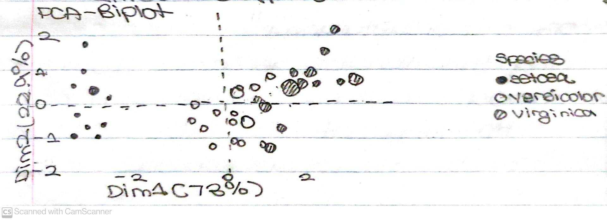

# Principal Component Analysis (PCA)

## Contents
* [Brief Description](#Brief-Description)
    * [Difference From Linear Regression](#Difference-From-Linear-Regression)
    * [PCA Biplot](#PCA-Biplot)
    * [Main Usage](#Main-Usage)
        * [Tradeoff](#Tradeoff)
* [Jupyter Notebook](#Jupyter-Notebook)
    * [Data Set](#Data-Set)
    * [Scaled Features](#Scaled-Features)
* [Source](#Source)

## Brief Description
Principal Component Analysis (also known as Factor Analysis) is an Unsupervised Machine Learning Technique that's used to examine the interrelations between sets of variables. It's used to transform a many-featured Data Set so that it has fewer features which are <i>linear combinations</i> of the original features. The transformed Data Set is intended to summarize most of the variance of the original Data Set (i.e. aims for simplicity).

### Difference From Linear Regression
Although this Machine Learning Algorithm seems similar to Linear Regression, the latter determines a <i>line of best fit</i> through a Data Set whereas the former
determines several <i>orthogonal lines of best fit</i> for a Data Set.

### PCA Biplot
In the Biplot displayed below:

<ul>
    <li>x-axis principal component examples 73% of the variance in the Data Set.</li>
    <li>y-axis principal component explains approximately 23% of the variance in the Data Set.</li>
    <li>Approximately 4% of the Data Set is unexplained.
        <ul>
            <li>Can explain more of the variance by adding more principal components to the analysis.</li>
        </ul>
    </li>
</ul>

<p align="center"></p>

### Main Usage
Principal Component Analysis is used by Data Scientists to transform a Data Set by determining the factors that have the most influence in it. It is often used for Exploratory Data Analysis in combination with a Classification Machine Learning Model (e.g. Logistic Regression, K-Nearest Neighbors) to make meaningful predictions.

#### Tradeoff
Using Principal Component Analysis greatly increases the simplicity of the Machine Learning Model. However, it also ends up increasing the difficulty of interpreting the meaning of individual variables.

## Jupyter Notebook
In our <a href= "https://nbviewer.jupyter.org/github/Dipto9999/ML-Introduction/blob/master/Principal_Component_Analysis/principal_component_analysis.ipynb">Notebook</a>, we are working with the Breast Cancer Data Set included with the <b>scikit-learn</b>
<b>Python</b> library as in the Support Vector Machines Algorithm. 

### Data Set
Our Principal Component Analysis Model is used to reduce the 30 features described in the Data Set by transforming them in another Data Set with 2 principal components. Since principal components are linear combinations of the original features in the Data Set, they are calculated by adding and subtracting the original features of the Data Set. A 2-D <b>NumPy</b> array is generated with 2 rows (i.e. principal components) and 30 columns (i.e. original features). The values of each item in array correspond to the coefficient on that specific feature in the Data Set. </br>

<i>For example, the equation for the first principal component is in the form 0.21890244x1 + 0.10372458x2 + ...</i>

### Scaled Features
Prior to combining the features of the Data Set to yield our principal components in a transformed Data Set, the original Data Set must be standardized so that each feature is approximately the same size. This procedure is accomplished using class <b>StandardScaler</b> from the <b>scikit-learn</b> library.
_____________________________________________________________________________________________________________________________________________

```python
# Use class StandardScaler from scikit-learn library.
from sklearn.preprocessing import StandardScaler

# Instantitate an object of class StandardScaler.
data_scaler = StandardScaler()

# Train object data_scaler on raw_data_frame Data Set.
    # Lets object data_scaler observe the characteristics of each feature in 
    # Data Set prior to transforming each feature to the same scale.
data_scaler.fit(raw_data_frame)

# Create a new Data Set with standardized observations.
scaled_data_frame = data_scaler.transform(raw_data_frame)
```
_____________________________________________________________________________________________________________________________________________

<p align="center"></p>

There is also a <a href = "principal_component_analysis.py">Python Script</a> written with additional comments to further understand the procedure of developing this Machine Learning Algorithm. 

## Source
<i>The information in this repository is derived from a FreeCodeCamp 
<a href= "https://www.freecodecamp.org/news/a-no-code-intro-to-the-9-most-important-machine-learning-algorithms-today">Article</a> written by Nick McCullum.</i>