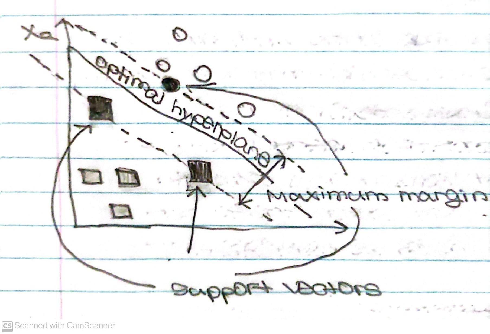

# Support Vector Machines (SVM)

## Contents
* [Brief Description](#Brief-Description)
    * [How SVMs Work](#How-SVMs-Work)
        * [Hyperplane](#Hyperplane)
        * [Support Vectors](#Support-Vectors)
* [Jupyter Notebook](#Jupyter-Notebook)
    * [Dataset](#Dataset)
* [Source](#Source)

## Brief Description
SVMs are Supervised Machine Learning Algorithms that divide a Dataset into categories by slicing through the widest gap in the data. They are primarily used for
classification problems, but may be used for regression problems as well.

### How SVMs Work
Given a set of training examples, a SVM Training Algorithm builds a model. This assigns new examples into one of two categories, making the SVM a non-probabilistic binary. The SVM uses <i>Geometry</i> to make categorical predictions.

#### Hyperplane
The model maps the data points in space and divides the separate categories by an open gap that's as wide as possible. A line is used to create this gap, referred to as a Hyperplane. This allows new data points to be predicted to belong to a category depending on which side of the Hyperplane they fall under. 

#### Support Vectors
Optimal Hyperplanes are defined in SVM Theory as Hyperplanes that maximize the margin between the closest data points from each category.

In this diagram, the margin line touches 3 data points (i.e. shaded data points from each category). These are referred to as Support Vectors and are what SVMs
derive their name from.

## Jupyter Notebook
We will use our SVM to solve a classification problem. In our <a href= "https://nbviewer.jupyter.org/github/Dipto9999/ML-Introduction/blob/master/Support_Vector_Machines/support_vector_machines.ipynb">Notebook</a>, we are working with the Breast Cancer Dataset included with the <b>scikit-learn</b>
<b>Python</b> library.

### Dataset
Our SVM Model is intended to predict what's stored under the target key in the DataFrame produced from the Dataset.

## Source
<i>The information in this repository is derived from a FreeCodeCamp
<a href= "https://www.freecodecamp.org/news/a-no-code-intro-to-the-9-most-important-machine-learning-algorithms-today">Article</a> written by Nick McCullum.</i>