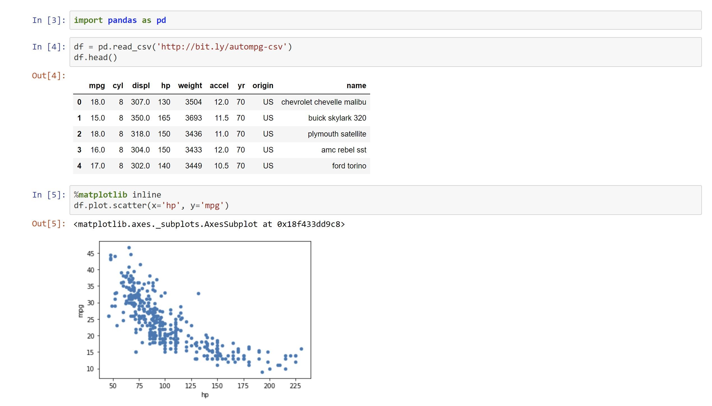

# Tutorial

## Brief Description
Upon installing the <b>Anaconda</b> Platform, I was emailed a 11 Minute video explaining
the basic functionalities of <b>Ananconda Navigator</b>. Then they covered the layout of 
<b>Jupyter Notebook</b>, which I would use for covering the FreeCodeCamp conceptual material
in <b>Python</b> and specifically with the <b>scikit-learn</b> library. I followed the instructions provided to make
my first <a href= "https://nbviewer.jupyter.org/github/Dipto9999/ML-Introduction/blob/master/Tutorial/Tutorial_Script.ipynb">Notebook</a>.

## Jupyter Notebook

## Source
<i>The information in this repository is derived from a FreeCodeCamp 
<a href= "https://www.freecodecamp.org/news/a-no-code-intro-to-the-9-most-important-machine-learning-algorithms-today">Article</a> written by Nick McCullum.</i>